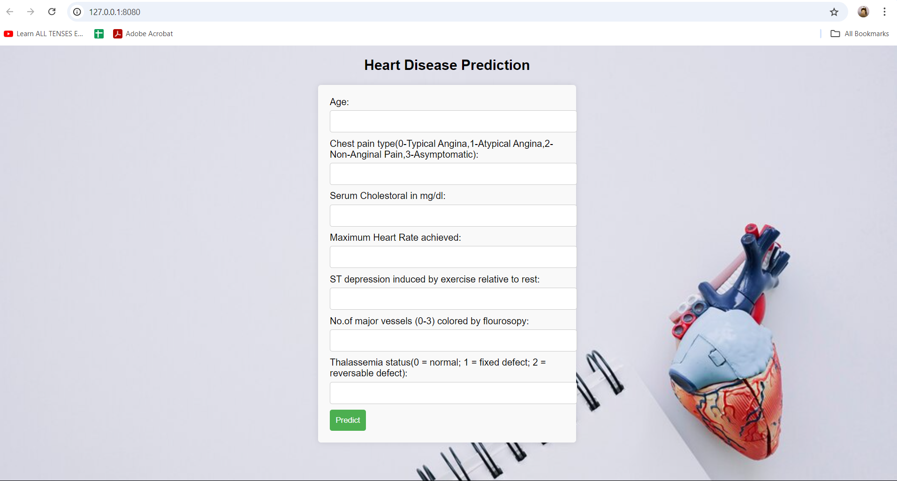

# Heart Disease Prediction Using Machine Learning

## Project Overview
This project aims to create a machine learning model to predict whether a patient is affected by heart disease based on various health metrics. The model is developed using Python and Flask, enabling seamless deployment for healthcare professionals.

## Steps to Develop the ML Model

1. **Collect the Data**: Gather relevant patient health data to form the dataset used for training the model.
   
2. **Import Libraries and Load the Data**: Utilize essential libraries such as Pandas, NumPy, and Scikit-learn to load and manipulate the data.
   
3. **Preprocess the Data**: Clean the dataset by handling missing values, outliers, and ensuring data quality for accurate predictions.
   
4. **Feature Engineering**: Analyze the data to identify and create relevant features that improve the model's performance.
   
5. **Model Creation**: Develop and train various machine learning models to predict heart disease. Implement techniques such as cross-validation to evaluate model performance.

6. **Save the Best Model**: Use libraries like `joblib` or `pickle` to save the model that performs best during evaluation for future use.

7. **Deployment**: Deploy the model using a Flask application. This includes setting up a web server to allow doctors to interact with the model through a user-friendly interface.

8. **Develop a Flask App**: 
   - Build a Flask application that integrates the saved best model to enable predictions based on new patient data.
   - Launch the local server app to facilitate user interaction and predictions in real-time.

## Key Features
- **User-friendly Interface**: The web application allows healthcare professionals to input patient data and receive immediate predictions regarding heart disease.
- **Scalability**: The model can be easily deployed to cloud platforms for broader access.
- **Early Diagnostics**: This application aids in early detection of heart disease, improving patient outcomes through timely intervention.

## Getting Started
1. Clone the repository:
   ```bash
   git clone <repository-url>
   cd heart-disease-prediction
   ```

2. Install required packages:
   ```bash
   pip install -r requirements.txt
   ```

3. Run the Flask application:
   ```bash
   python app.py
   ```

4. Open your web browser and navigate to `http://localhost:5000` to access the application.

5. Here you have your output screen.

## Conclusion
This project demonstrates the implementation of a machine learning model for heart disease prediction, with a focus on usability for healthcare professionals. The combination of data preprocessing, model training, and deployment using Flask ensures a practical solution for early diagnostics.
